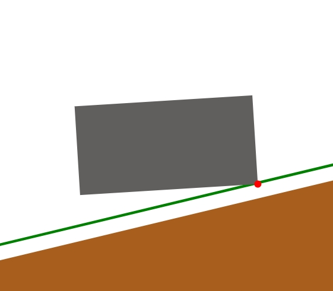

# Arbeitsansicht

Nach erfolgreicher Kalibrierung Ihres Systems gelangen Sie automatisch in die Arbeitsansicht, die Ihnen Informationen über die Positionierung der Baggerschaufel im Raum und in Bezug zur Planierfläche bietet und Sie bei Ihren Arbeiten visuell unterstützt.

## Batterieanzeige von Anzeige, Basis und Sensor

Die Kopfleiste der Arbeitsansicht zeigt stets den aktuellen Akkustand von jeweils Anzeige, Basisstation und Sensor an. Achten Sie idealerweise darauf, dass die Akkustände nicht unter 10% fallen, da sich dies insbesondere bei Sensor und Basisstation negativ auf die Performanz auswirken kann. Eine volle Akkuladung reicht circa acht Stunden und die Ladezeit beläuft sich in etwa auf vier Stunden. 

## Frontalansicht - Baggerschaufel in Bezug zur Planierfläche

Die linke obere Box in der Arbeitsansicht visualisiert die Baggerschaufel in einer 2D-Frontalansicht. In der obigen Abbildung stellt das graue Rechteck die Schaufel dar (Seitenverhältnisse entsprechend der Eingabe von Höhe und Breite bei der Vermessung), der rote Punkt an der unteren rechten Ecke der Schaufel die ausgewählte Schaufelecke und braun eingefärbt ist die von Ihnen erstellte Planierfläche ([Flächenerstellungen](https://docs.excav.de/app/funktionen/flaeche/)). Sollten Sie noch keine eigene Fläche erstellt haben, dann wird standardmäßig eine Parallele zur Horizontalen auf Höhe des Referenzpunktes gezogen. Der grüne Strich zeigt die Höhe der erstellten Fläche ohne Versatz an (nur sichtbar, falls ein [Versatz](https://docs.excav.de/app/funktionen/flaeche/#hohenversatz-der-planierflache-wahlen) angesetzt wurde), die versetzt eingestellte Fläche (Zielfläche) wird braun dargestellt.

## Seitenansicht - Baggerschaufel in Bezug zur Planierfläche

Die rechte obere Box in der Arbeitsansicht visualisiert die Baggerschaufel in einer 2D-Seitenansicht. In der obigen Abbildung ist durch die grüne Linie die von Ihnen erstellte Planierfläche gezeigt ([Flächenerstellungen](https://docs.excav.de/app/funktionen/flaeche/)). Die Zielfläche, also mit dem von Ihnen eingestellten Versatz zur Fläche, wird braun dargestellt. Sollten Sie noch keine eigene Fläche erstellt haben, dann wird standardmäßig eine Parallele zur Horizontalen auf Höhe des Referenzpunktes gezogen. Der grüne Strich zeigt zudem den Versatz zur ursprünglichen Fläche an (nur sichtbar, falls ein [Versatz](https://docs.excav.de/app/funktionen/flaeche/#hohenversatz-der-planierflache-wahlen) angesetzt wurde). 

## Draufsicht Baustelle / Bauplan

Die Draufsicht auf die Baustelle informiert Sie über die Position der Baggerschaufel (der rote horizontale Strich, Länge entsprechend der eingegebenen Schaufelbreite) in Bezug zu Referenzpunkt (REF) und von Ihnen erfassten Punkten auf der Baustelle (in der Beispielgrafik wurde lediglich der Referenzpunkt erfasst). Zudem zeigt der rot gekennzeichnete Vektor N stets Richtung Norden. 

Sie können auch Ihren eigenen Bauplan in der Draufsicht hochladen. Mehr Informationen hier zu unter App "Bauplan laden". 

## Anzeige der horizontalen und vertikalen Abweichung
Der vertikale Balken auf der linken Seite der Arbeitsansicht zusammen mit dem horizontalen Balken, welcher die Schaufelansichten von der Draufsicht auf den Bauplan trennt, stellen das Analogon zur Anzeige am Baggerarm (vgl. [Anzeigekreuz](https://docs.excav.de/uebersicht/#anzeigekreuz)) dar. Je nach Präferenz oder falls die Anzeige am Baggerarm aus dem Fahrerhaus nicht gut einsehbar ist, können hierüber aktuelle Höhen- und Neigungsabweichungen von den Soll-Werten abgelesen werden. Der mittige, dunkelgrüne Strich in beiden Balken bezeichnet den jeweiligen Soll-Wert. 