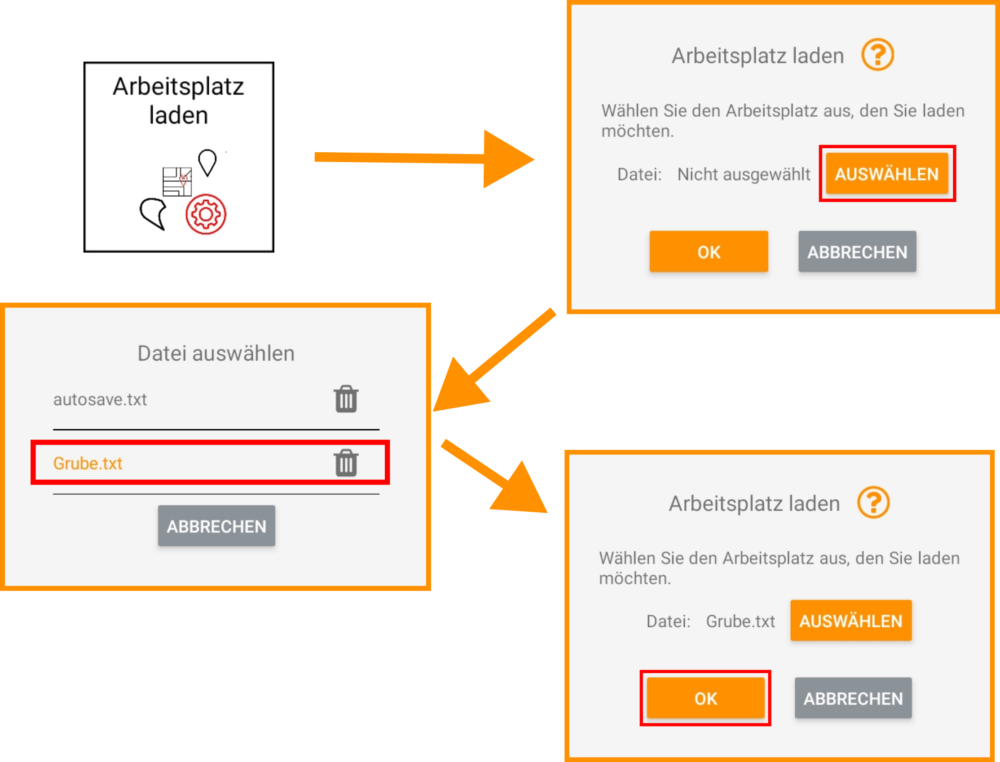

## Arbeitsplatz laden

<!-- WARNING Arbeitsplatz laden - Basisstation und Referenzpunkt  -->

Sie können einen zuvor abgespeicherten Arbeitsplatz wieder laden. In Ihrem Arbeitsplatz befinden sich folgende Informationen:

* Alle erfassten Punkte inklusive Referenzpunkt
* Alle erfassten Strecken, Geraden und Polyeder
* Die aktuell aktive Fläche mit eingestelltem Versatz und aktiver Werkzeugecke
* Den aktuell geladenen und ausgerichteten Bauplan
* Alle erstellten Werkzeuge (Löffel und Schaufeln)

WICHTIG: Im Arbeitsplatz sind alle Punkte relativ zum Referenzpunkt gespeichert (sie haben keine absoluten Koordinaten) und der Referenzpunkt wird in Relation zur Basisstation erfasst. Das bedeutet, dass Sie beim Laden des Arbeitsplatzes zwei Möglichkeiten haben: 

1. Sie haben seit den letzten Arbeiten die Basisstation nicht bewegt (z.B. über die Mittagspause haben Sie das System ausgeschaltet). Dann können Sie ohne den Referenzpunkt neu zu setzen ohne Probleme dort weiterarbeiten, wo Sie aufgehört haben. 

2. Die Basisstation wurde seit den letzten Arbeiten bewegt. Können Sie auf wenige Milimeter genau bestimmen, wo sich die Basisstation während der letzten Arbeiten befunden hat? Wenn nicht empfehlen wir, den Referenzpunkt erneut zu vermessen, indem Sie mit dem Messstab so genau wie möglich den Referenzpunkt der letzten Arbeiten antasten und erfassen. Die neue Position der Basisstation ist dann egal und führt nicht zu Fehlern. 

<!-- Bitte beachten Sie, dass sich alle erfassten Punkte um den Positionsfehler der Basisstation bzw. des neu gesetzten Referenzpunktes verschieben.  -->

!!! danger "Positionsfehler der Basis"
    Sollten Sie die Basisstation nicht wieder auf exakt die selbe Position wie zuvor setzen und auch den Referenzpunkt nicht neu antasten, dann verschieben sich alle im Arbeitsplatz aufgenommenen Punkte um die Distanz zwischen der derzeitigen und der vorherigen Position der Basisstation. Dieser Positionsfehler zieht sich dann durch alle weiteren Arbeiten. Sind Sie sich unsicher, dann setzen Sie den Referenzpunkt neu. Die Position der Basisstation ist dann egal.