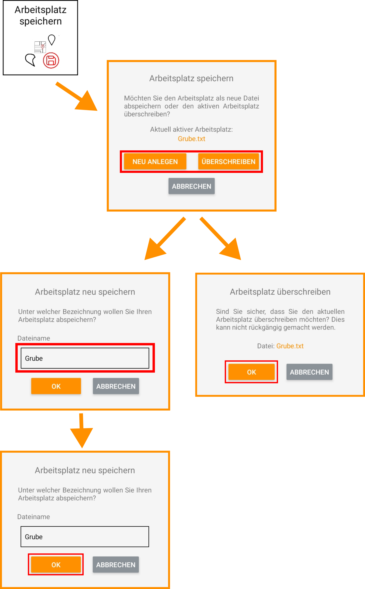

## Arbeitsplatz speichern

"Arbeitsplatz speichern" benutzen Sie, um alle erfassten - für Ihre Baustelle relevanten - Werte und Einstellungen zu speichern. Sie haben hierfür zwei Optionen. Entweder Sie erstellen eine neue Datei (Neu anlegen) oder überschreiben einen bereits existierenden Arbeitsplatz (Überschreiben). 

Im Arbeitsplatz abgespeichert werden folgende Informationen:

* Alle erfassten Punkte inklusive Referenzpunkt
* Alle erfassten Strecken, Geraden und Polyeder
* Die aktuell aktive Fläche mit eingestelltem Versatz und aktiver Werkzeugecke
* Den aktuell geladenen und ausgerichteten Bauplan
* Alle erstellten Werkzeuge (Löffel und Schaufeln)

Bitte beachten Sie, dass Sie alle Änderungen manuell erneut abspeichern müssen. Schließen Sie die App, dann gehen alle nicht abgespeicherten Änderungen verloren (Minimieren der App ist dagegen kein Problem). 
Ob Sie ungespeicherte Änderungen in Ihrem Arbeitsplatz haben, können Sie ganz unten im Funktionsbildschirm(LINK) überprüfen. 
