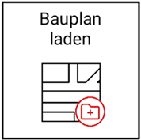
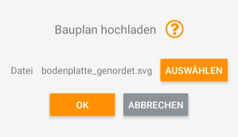

# Baupläne vorbereiten und einbinden

## Bauplan als SVG laden

Sie können - falls vorhanden -  auch einen konkreten Bauplan Ihrer Baustelle in die Kartenansicht der [Arbeitsansicht](https://docs.excav.de/app/arbeitsansicht/) einbinden. Die unter “AUSWÄHLEN” aufgelisteten Dateien beinhalten ausschließlich jene Dateien des Formates .svg, welche in dem Ordner "/Downloads/SVG_folder" ihres Tablets abgelegt wurden. Um Ihren Bauplan auf dem Tablet zu speichern, gehen Sie bitte wie folgt vor: Minimieren Sie die App, schießen Sie das Tablet an Ihren PC an, öffnen Sie auf dem PC den internen Speicher des Tablets, gehen Sie in den Ordner “/Downloads/SVG_folder” und speichern Sie dort Ihren Bauplan ab. Beachten Sie bitte, dass vorerst nur Baupläne des Formates .svg gelesen werden können. Sollte Sie darüber hinaus noch Probleme beim Auswählen Ihres Bauplans in der App haben, dann kann es sein, dass Sie Ihrer excav App erst die Berechtigung erteilen müssen, auf den externen Speicher ihres Tablets zugreifen zu dürfen. Schließen Sie hierfür Ihre App, gehen Sie zu “Einstellungen -> Apps -> excav PILOT -> Berechtigungen” und aktivieren Sie dort die Erlaubnis für Fotos und Videos. Starten Sie im Anschluss die App neu. 

!!! info "Konvertierung von Bauplänen"
    Sollten Unklarheiten in Bezug auf die Erstellung eines stimmigen .svg Bauplans bestehen (z.B. weil Sie Ihren Bauplan lediglich im .pdf Format vorliegen haben oder weil noch eine Positionsnormierung vorgenommen werden muss), können Sie sich an uns wenden unter support@excav.de bzw. telefonisch unter +49(0)1520 8299517. Wir übernehmen die Umwandlung gerne für Sie.