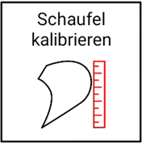
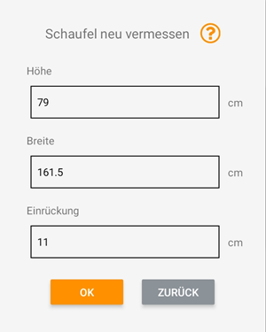

## Löffelmaße abändern / neu bestimmen

Mit dieser Funktion können Sie die bereits während der Kalibrierung vorgenommenen Abmessungen des Löffels ändern, z.B. falls Sie sich vermessen haben oder der Löffel gewechselt wurde (siehe [Löffel vermessen](https://docs.excav.de/erste_schritte/einrichten/#schaufel-vermessen)). 