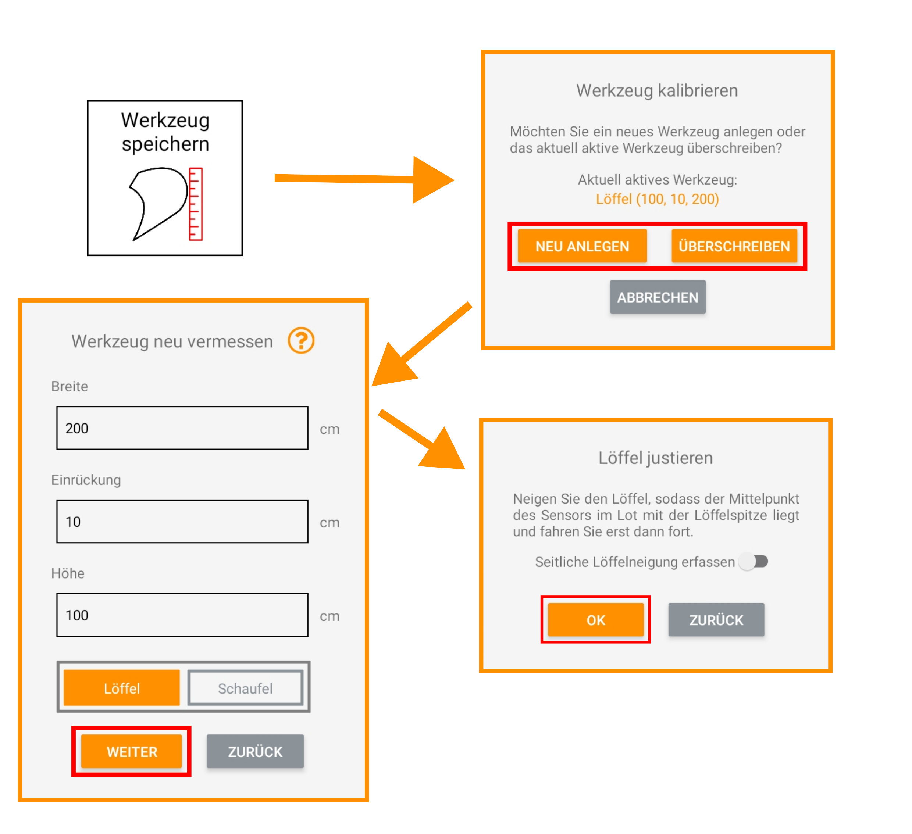

## Löffelmaße abändern / neu bestimmen

<!-- 

 -->

<!-- Indem Sie "Überschreiben" auswählen, können Sie die bereits während der Kalibrierung vorgenommenen Abmessungen des Löffels ändern, z.B. falls Sie sich vermessen haben oder der Löffel gewechselt wurde (siehe [Löffel vermessen](https://docs.excav.de/erste_schritte/system_einrichten/#löffel-vermessen)).  -->
Mit der Funktion "Werkzeug speichern" können Sie entweder ein neues Werkzeug (Löffel oder Schaufel) anlegen oder Ihr aktuell aktives Werkzeug überschreiben (z.B. falls Sie sich vermessen haben). Ausführliche Informationen zum Vermessen des Löffels finden Sie unter [Löffel vermessen](https://docs.excav.de/erste_schritte/system_einrichten/#loffel-vermessen).