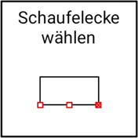
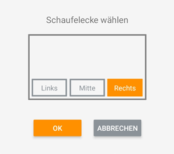

## Werkzeugecke wechseln

Diese Funktion bietet Ihnen die Möglichkeit, Ihre während der Kalibrierung festgelegte Löffelecke (primär notwendig zum Antasten von Punkten) zu wechseln. Je weiter die Löffelecke vom Sensor entfernt ist, desto größer wird der Höhenfehler. Wir empfehlen daher, im Normalfall die Mitte oder die rechte Löffelecke (bei Montage des Sensors auf der rechten Seite) zu nutzen. Sollte der Sensor links montiert sein, empfehlen wir entsprechend die Mitte oder die linke Löffelecke.