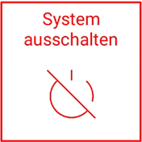

# Sonstige Einstellungen 

## Einstellungen des Anzeigekreuzes

Die Einstellungen des Anzeigekreuzes erlauben es Ihnen die Helligkeit der LEDs festzulegen und Anpassungen der horizontalen sowie vertikalen Ausschlagssensibilität vorzunehmen. Die Standardeinstellungen sind: LED-Helligkeit: 24%, LED-Abstand horizontal: 1 Grad pro LED, LED-Abstand vertikal: 20mm pro LED. Beachten Sie, dass sich erhöhte LED-Helligkeit negativ auf die Akkudauer der LED-Anzeige auswirkt. 

## Baumaschinentyp wählen

Als visuelles Feature für die Arbeitsansicht bietet sich auch die Option, die Seitenansicht Ihrer Baumaschine entsprechend des Baumaschinentyps zu wählen. Sie können hierbei zwischen Bagger, Radlader und Raupe wählen. 

## Referenzpunkt neu setzen

Diese Funktion erlaubt eine Neuermittlung des Referenzpunkts. 

!!! danger "Warnung: Setzen des Referenzpunktes"
    Wenn Sie den Referenzpunkt neu setzen, werden alle bisher erfassten und eingestellten Punkte oder Flächen um die Differenz zwischen dem aktuellen Referenzpunkt und dem neuen Referenzpunkt verschoben und sind somit nicht mehr gültig! Wenn die Basisstation neu gestartet wurde oder eine neue Positionserfassung durchgeführt wurde, kann durch erneutes Setzen des Referenzpunktes an der Stelle des alten Referenzpunktes die Arbeitsfläche wieder zur Baustelle synchronisiert werden.

## Ausschalten und verstauen

Die Hardware kann über “Funktionen => System ausschalten” komplett abgeschaltet werden. Alternativ können durch die Betätigung der Drucktaster an Basisstation, Anzeige und Sensor diese abgeschaltet werden. 

Das Tablet kann über den Ein/Aus Taster in den Ruhemodus versetzt werden. Dies spart Akku und die Konfiguration des Sensors geht dabei nicht verloren. Es kann dann auch weiterhin mit der Anzeige gearbeitet werden.

