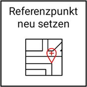

# Sonstige Einstellungen 

## Einstellungen des Anzeigekreuzes

Die Einstellungen des Anzeigekreuzes erlauben es Ihnen die Helligkeit der LEDs festzulegen und Anpassungen der horizontalen sowie vertikalen Ausschlagssensibilität vorzunehmen. Die Standardeinstellungen sind: LED-Helligkeit: 24%, LED-Abstand horizontal: 1 Grad pro LED, LED-Abstand vertikal: 20mm pro LED. Beachten Sie, dass sich erhöhte LED-Helligkeit negativ auf die Akkudauer der LED-Anzeige auswirkt. 

## Baumaschinentyp wählen
Als visuelles Feature für die Arbeitsansicht bietet sich auch die Option, die Seitenansicht Ihrer Baumaschine entsprechend des Baumaschinentyps zu wählen. Sie können hierbei zwischen Bagger, Radlader und Raupe wählen. 

## Referenzpunkt neu setzen

Diese Funktion erlaubt eine Neuermittlung des Referenzpunkts. WARNUNG: Wenn Sie den Referenzpunkt neu setzen, werden alle bisher erfassten oder eingestellten Punkte oder Flächen um die Differenz zwischen dem aktuellen Referenzpunkt und dem neuen Referenzpunkt verschoben und sind somit nicht mehr gültig! Wenn die Basisstation neu gestartet wurde oder eine neue Positionserfassung durchgeführt wurde, kann durch erneutes Setzen des Referenzpunktes an der Stelle des alten Referenzpunktes die Arbeitsfläche wieder zur Baustelle synchronisiert werden.

