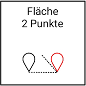
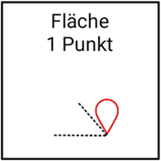
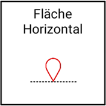
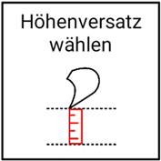

# Flächen erstellen

## Fläche aus drei Punkten

Mit dieser Funktion können Sie eine Fläche (Ihre gewünschte Planierfläche) aus drei von Ihnen ausgewählten Punkten erschaffen (die Punkte müssen erst erfasst werden und in die Punkteliste eingespeichert werden, siehe [Punkte erfassen](https://docs.excav.de/app/funktionen/punkte/)). Eine Fläche im Raum ist durch drei Punkte eindeutig definiert. Als Punkte bieten sich zum Beispiel drei Eckpunkte auf der Baustelle an. 

## Fläche aus zwei Punkten und einem Winkel

Mit dieser Funktion können Sie eine Fläche (Ihre gewünschte Planierfläche) aus zwei von Ihnen ausgewählten Punkten und einem Neigungswinkel erschaffen (die Punkte müssen erst erfasst werden und in die Punkteliste eingespeichert werden, siehe [Punkte erfassen](https://docs.excav.de/app/funktionen/punkte/)). Sie können zudem die Höhe des zweiten Punktes im Raum an die Höhe des ersten Punktes angleichen, um lediglich eine Flächenneigung in eine Richtung zu garantieren. Legen Sie hierfür den Regler “Höhe angleichen” um. Der Neigungswinkel steht orthogonal (d.h. 90° nach rechts) zu dem Richtungsvektor von Punkt 1 zu Punkt 2. Beispiel: Sie haben zwei Punkte A und B, wobei A als Punkt 1 und B als Punkt 2 ausgewählt wurde. Wenn Sie nun von Punkt A zu Punkt B schauen, steigt die Fläche nach rechts im eingegebenen Neigungswinkel an. 

## Fläche definiert durch Punkt, Ausrichtung und Steigung

Mit dieser Funktion können Sie eine Fläche (Ihre gewünschte Planierfläche) aus einem von Ihnen ausgewählten Punkt, einem Neigungswinkel und einem Richtungswinkel erschaffen (der Punkt muss erst erfasst werden und in die Punkteliste eingespeichert werden, siehe [Punkte erfassen](https://docs.excav.de/app/funktionen/punkte/)). Sie können als Richtung eine gezielte Himmelsrichtung auswählen (z.B. Ausrichtung nach Norden 0°, Osten 90°, Süden 180° oder Westen 270°) oder Sie nutzen die Schaufelrichtung (Fläche steigt dann hinter der Schaufel an). Legen Sie hierfür den Regler “Schaufelrichtung nutzen” um und  schwenken Sie den Bagger, sodass die Baggerschaufel in die gewünschte Richtung zeigt, bevor Sie die Flächenberechnung starten.

## Parallele Fläche zur Horizontalen definiert durch einen Punkt

Mit dieser Funktion können Sie eine Fläche (Ihre gewünschte Planierfläche) mit Hilfe eines von Ihnen ausgewählten Punktes erschaffen (der Punkt muss erst erfasst werden und in die Punkteliste eingespeichert werden, siehe [Punkte erfassen](https://docs.excav.de/app/funktionen/punkte/)). Für die Flächenberechnung wird lediglich die Höhe des ausgewählten Punkts herangezogen. Auf Basis dieser Höhe wird dann eine Parallele zur Horizontalen geschaffen.

## Höhenversatz der Planierfläche wählen

Diese Funktion bietet Ihnen die Möglichkeit, ihre Planierfläche parallel zu verschieben, indem Sie einen Versatz eingeben. Negativer Versatz bedeutet Verschiebung nach unten (z.B. hilfreich, wenn Gelände abgetragen werden soll) und positiver Versatz bedeutet Verschiebung nach oben (z.B. hilfreich, wenn Erde aufgeschüttet werden soll). Der Versatz kann zudem vertikal oder orthogonal bemessen werden. Vertikaler Versatz bemisst sich senrecht zur Horizontalen, wohingegen orthogonaler Versatz orthogonal zur ursprünglichen Fläche gemessen wird. Legen Sie den Regler “Orthogonalen Versatz verwenden” um, falls Sie Ihre Abmessung orthogonal zur Ursprungsfläche vornehmen wollen (z.B. wenn Sie eine Schicht Humus gegebener Dicke entsprechend dem Versatz auf eine geneigte Fläche aufbringen möchten).

