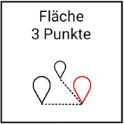

# Flächen erstellen

## Fläche aus drei Punkten

Nachdem Sie drei [Punkte erfasst](https://docs.excav.de/app/funktionen/punkte/) haben, können Sie eine Fläche (Ihre gewünschte Planierfläche) aus den von Ihnen ausgewählten Punkten erschaffen. Eine Fläche im Raum ist durch drei Punkte eindeutig definiert. Als Punkte bieten sich zum Beispiel drei Eckpunkte auf der Baustelle an. 

## Fläche aus zwei Punkten und einem Winkel

Mit dieser Funktion können Sie eine Fläche (Ihre gewünschte Planierfläche) aus zwei von Ihnen ausgewählten [Punkten](https://docs.excav.de/app/funktionen/punkte/) und einem Neigungswinkel erschaffen. Sie können zudem die Höhe des zweiten Punktes im Raum an die Höhe des ersten Punktes angleichen, um lediglich eine Flächenneigung in eine Richtung zu garantieren. Legen Sie hierfür den Regler “Höhe angleichen” um. Der Neigungswinkel steht orthogonal (d.h. 90° nach rechts) zu dem Richtungsvektor von Punkt 1 zu Punkt 2. Dies soll folgendes Beispiel erläutern: Sie haben zwei Punkte A und B eingemessen, wobei A als Punkt 1 und B als Punkt 2 in der Flächenerstellung ausgewählt wurde. Wenn Sie nun von Punkt A zu Punkt B schauen, steigt die Fläche nach rechts im eingegebenen Neigungswinkel an. 

## Fläche definiert durch Punkt, Ausrichtung und Steigung

Mit dieser Funktion können Sie eine Fläche (Ihre gewünschte Planierfläche) aus einem von Ihnen ausgewählten [Punkt](https://docs.excav.de/app/funktionen/punkte/), einem Neigungswinkel und einem Richtungswinkel erschaffen. Sie können als Richtung eine gezielte Himmelsrichtung auswählen (z.B. Ausrichtung nach Norden 0°, Osten 90°, Süden 180° oder Westen 270°) oder Sie nutzen die Löffelrichtung (Fläche steigt dann hinter dem Löffel an). Legen Sie hierfür den Regler “Löffelrichtung nutzen” um und schwenken Sie den Bagger, sodass der Baggerlöffel in die gewünschte Richtung zeigt, bevor Sie die Flächenberechnung starten.

## Parallele Fläche zur Horizontalen definiert durch einen Punkt

Mit dieser Funktion können Sie eine Fläche (Ihre gewünschte Planierfläche) mit Hilfe eines von Ihnen ausgewählten [Punktes](https://docs.excav.de/app/funktionen/punkte/) erschaffen. Für die Flächenberechnung wird lediglich die Höhe des ausgewählten Punktes herangezogen. Auf Basis dieser Höhe wird dann eine parallele Ebene zur Horizontalen geschaffen.

## Höhenversatz der Planierfläche wählen

Nachdem Sie mittels einer der obigen Funktionen Ihre Ebene (Ist-Fläche) erstellt haben, müssen Sie einen Höhenversatz wählen, um so die Soll-Fläche in Ihrer Arbeitsansicht zu definieren. Sie können dabei einstellen, ob Sie einen Versatz nach oben (z.B. hilfreich, wenn Erde aufgeschüttet werden soll) oder einen Versatz nach unten (z.B. hilfreich, wenn Gelände abgetragen werden soll) haben möchten. Der Versatz kann zudem vertikal oder orthogonal bemessen werden. Vertikaler Versatz bemisst sich senkrecht zur Horizontalen, wohingegen orthogonaler Versatz orthogonal zur ursprünglichen Ebene gemessen wird.

