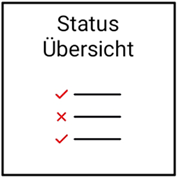
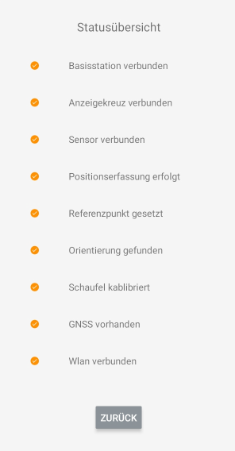
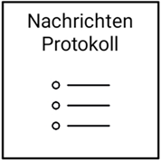
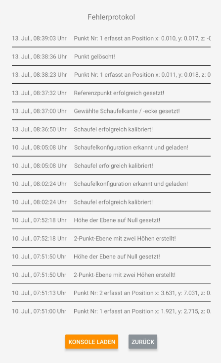

# Protokoll und Status

## Status-Übersicht

Die Status-Übersicht dient als Hilfe bei der Inbetriebnahme Ihres Systems. Dort aufgelistet finden Sie alle relevanten Kennzeichen (Verbindung zu den einzelnen Systemeinheiten Sensor, Anzeige und Basis; Positionserfassung; Referenzpunkt setzen; Orientierung; Löffelkalibrierung; GNSS-RTK; WLAN-Verbindung).
Sollten ein oder mehrere dieser Schritte nicht erfolgt sein, kann das System nicht in Betrieb genommen werden. Alle Kennzeichen - bis auf das Erfassen der Orientierung - werden im geführten Menü des [Einrichtungsassistenten](https://docs.excav.de/app/einrichtungsassistent/) abgefragt. Beklagt die App das Fehlen mehrerer der oben aufgelisteten Kennzeichen, empfiehlt sich entsprechend eine wiederholte Durchführung des Einrichtungsassistenten. Das System findet die Orientierung im Normalfall nach wenigen Minuten von selbst (hierfür muss der Baggerlöffel bewegt und geschwenkt werden). Existiert keine GNSS-RTK-Lösung, befinden Sie sich wahrscheinlich mit dem Sensor zu nahe an größeren Strukturen wie Bäumen oder Häusern. 

## Nachrichtenprotokoll

Das Log-Window agiert als App-interne Konsole, welche etwaige Nutzeraktivitäten und die Kommunikation mit der Hardware protokolliert. Sollten Probleme bei der Benutzung des Systems auftreten, laden Sie bitte die Konsole aus dem internen Speicher des Tablets (“KONSOLE LADEN”) und schicken Sie einen Screenshot/ ein Foto an support@excav.de.
(Bitte bei Problemen zuerst die Status-Übersicht prüfen)

