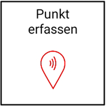
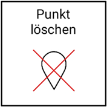
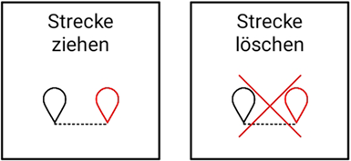
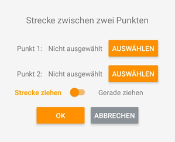

# Punkte und Strecken

## Punkte erfassen 

Mit dieser Funktion können Sie Punkte auf der Baustelle erfassen und in einer Punkteliste abspeichern. Bewegen Sie hierzu die ausgewählte Ecke des Baggerlöffels auf den entsprechenden Punkt im Raum und speichern Sie diesen in einem der Punkt-Slots (A, B, C, …) ab. Aus der Punkteliste können Sie im Folgenden Punkte auswählen, mit Hilfe derer Sie Flächen im Raum erschaffen können (z.B. Fläche durch drei Punkte ziehen). Die Punkte können zudem als Orientierung auf der Baustelle dienen.

## Punkte löschen

Sollten Sie einen oder mehrere Ihrer bereits abgespeicherten Punkte für künftige Bauarbeiten nicht mehr benötigen, können Sie diese(n) wieder aus Ihrer Punkteliste löschen. Hierzu den zugehörigen Punkt-Slot auswählen und auf “Punkt löschen” klicken.

## Strecken und Geraden ziehen / löschen

Sie können in der Kartenansicht der Arbeitsansicht auch Strecken bzw. Geraden abbilden. Erfassen Sie hierfür den Startpunkt und Endpunkt der Strecke als Punkt in der App ([Punkte erfassen]()). Wählen Sie die erfassten Punkte im Anschluss aus, bestimmen Sie mithilfe des darunterliegenden Reglers, ob Sie die Punkte mit einer Strecke verbinden möchten oder eine durchgehende Gerade legen wollen und bestätigen Sie Ihre Auswahl mit “OK”. Die Strecke wird automatisch generiert und ist in der Arbeitsansicht einsehbar. Aktuell ist es nur möglich, eine einzige Strecke zu erstellen. Bei der Erstellung einer weiteren Strecke bzw. Gerade wird die zuvor erstellte Strecke bzw. Gerade überschrieben. 
Wird die erstellte Strecke bzw. Gerade für anschließende Bauarbeiten nicht mehr benötigt und die Bauplanübersicht dadurch behindert, können Sie diese mithilfe von “Strecke löschen” auch wieder entfernen. 

