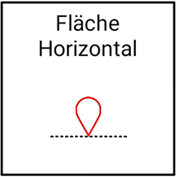

## Parallele Fläche zur Horizontalen definiert durch einen Punkt

Mit dieser Funktion können Sie eine Fläche (Ihre gewünschte Planierfläche) mit Hilfe eines von Ihnen ausgewählten [Punktes](https://docs.excav.de/app/funktionen/punkte/) erschaffen. Für die Flächenberechnung wird lediglich die Höhe des ausgewählten Punktes herangezogen. Auf Basis dieser Höhe wird dann eine parallele Ebene zur Horizontalen geschaffen.