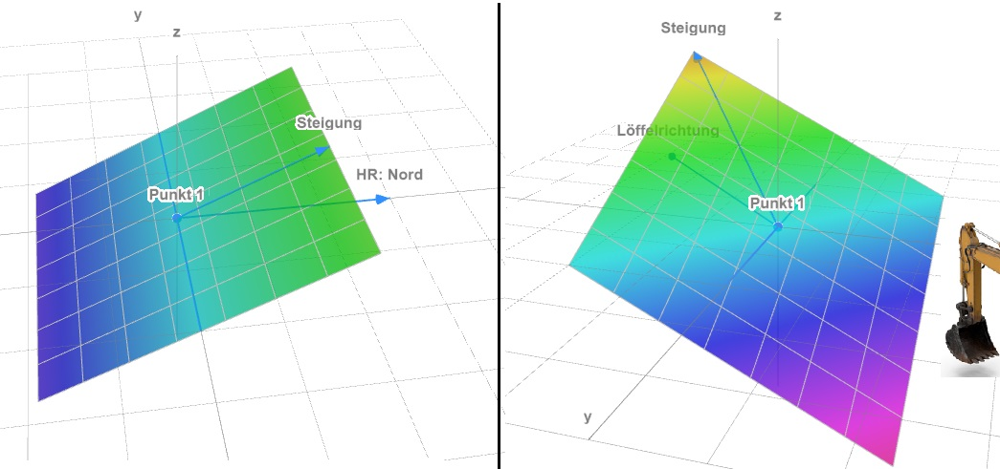

## Fläche definiert durch Punkt, Ausrichtung und Steigung

<!--  -->

Mit dieser Funktion können Sie eine Fläche (Ihre gewünschte Planierfläche) aus einem von Ihnen ausgewählten [Punkt](https://docs.excav.de/app/funktionen/punkte_und_flächen/punkte_erfassen/), einem Neigungswinkel und einem Richtungswinkel erschaffen. Sie können als Richtung eine gezielte Himmelsrichtung auswählen (z.B. Ausrichtung nach Norden 0°, Osten 90°, Süden 180° oder Westen 270°) oder Sie nutzen die Löffelrichtung (Fläche steigt dann hinter dem Löffel an). Legen Sie hierfür den Regler “Löffelrichtung nutzen” um und schwenken Sie den Bagger, sodass der Baggerlöffel in die gewünschte Richtung zeigt, bevor Sie die Flächenberechnung starten.

<figure markdown="span">
  
  <figcaption>Fläche mit 1 Punkt | Links: Himmelsrichtung, Rechts: Löffelrichtung<figcaption>
</figure>