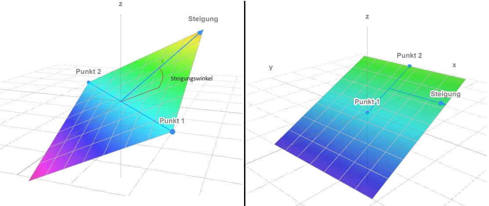

## Fläche aus zwei Punkten und einem Winkel

<!--  -->

Mit dieser Funktion können Sie eine Fläche (Ihre gewünschte Planierfläche) aus zwei von Ihnen ausgewählten [Punkten](https://docs.excav.de/app/funktionen/punkte_und_flächen/punkte_erfassen/) und einem Neigungswinkel erschaffen. Sie können zudem die Höhe des zweiten Punktes im Raum an die Höhe des ersten Punktes angleichen, um lediglich eine Flächenneigung in eine Richtung zu garantieren. Legen Sie hierfür den Regler “Höhe angleichen” um. Der Neigungswinkel steht orthogonal (d.h. 90° nach rechts) zu dem Richtungsvektor von Punkt 1 zu Punkt 2. Dies soll folgendes Beispiel erläutern: Sie haben zwei Punkte A und B eingemessen, wobei A als Punkt 1 und B als Punkt 2 in der Flächenerstellung ausgewählt wurde. Wenn Sie nun von Punkt A zu Punkt B schauen, steigt die Fläche nach rechts im eingegebenen Neigungswinkel an. 

<figure markdown="span">
  
  <figcaption>Zwei Möglichkeiten eine Fläche mit 2 Punkten zu erstellen<figcaption>
</figure>