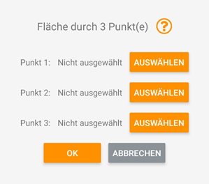
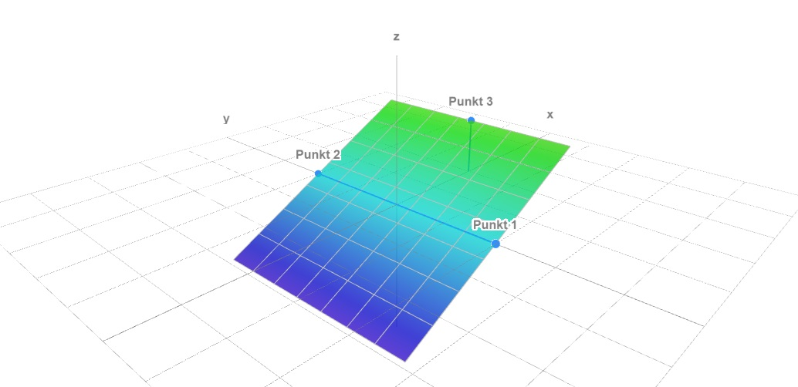

## Fläche aus drei Punkten

<!--  -->

Nachdem Sie drei [Punkte erfasst](https://docs.excav.de/app/funktionen/punkte_und_flächen/punkte_erfassen/) haben, können Sie eine Fläche (Ihre gewünschte Planierfläche) aus den von Ihnen ausgewählten Punkten erschaffen. Eine Fläche im Raum ist durch drei Punkte eindeutig definiert. Als Punkte bieten sich zum Beispiel drei Eckpunkte auf der Baustelle an. 

<figure markdown="span">
  
  <figcaption>Graphisches Beispiel für eine Fläche mit 3 Punkten<figcaption>
</figure>