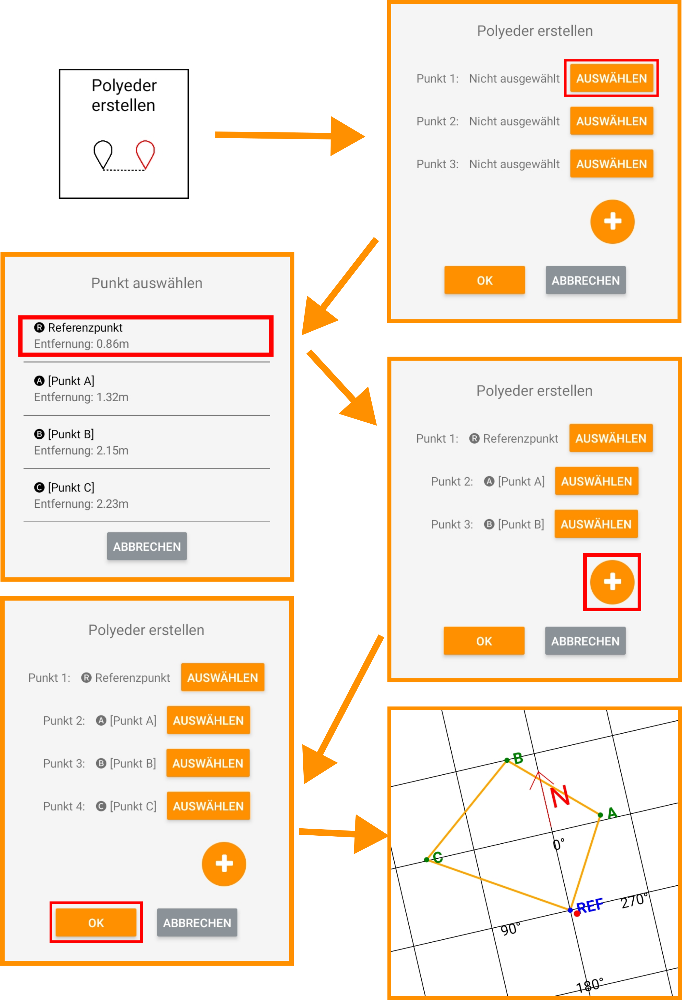

## Polyeder erstellen

Möchten Sie mehrere Punkte geschlossen mit Strecken verbinden, so können Sie ein Polyeder erstellen. Wählen Sie hierzu 3 oder mehr Punkte in der Reihenfolge aus, in der diese Punkte verbunden werden sollen. Dabei wird Punkt 1 mit Punkt 2, Punkt 2 mit Punkt 3, Punkt 3 mit Punkt 4, usw. verbunden. Der letzte Punkt wird dann wieder mit Punkt 1 verbunden. Mit dieser Funktion lassen sich z.B. Baugruben in der Arbeitsansicht einzeichnen.