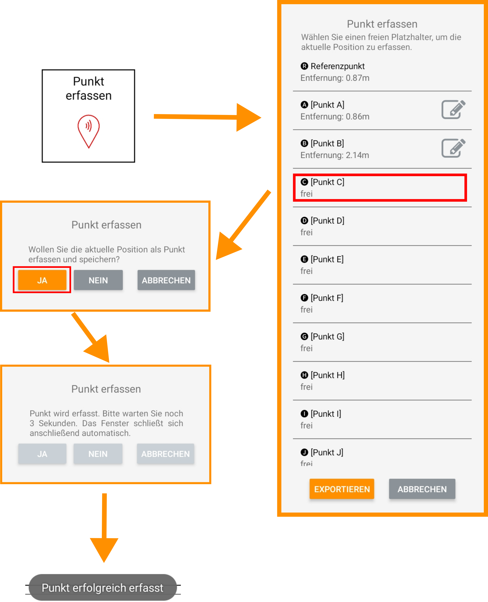
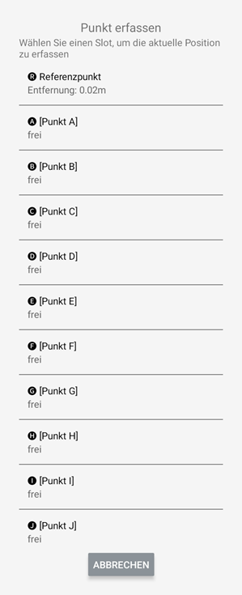
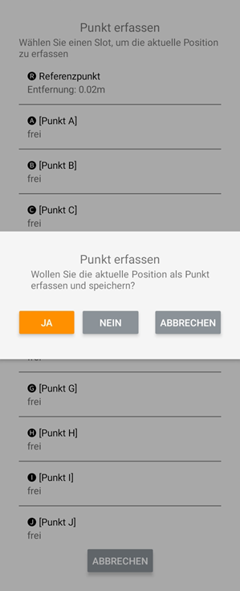

## Punkte erfassen 

<!-- 

 -->

Mit dieser Funktion können Sie Punkte auf der Baustelle erfassen und in einer Punkteliste abspeichern. Bewegen Sie hierzu die ausgewählte Ecke des Baggerlöffels auf den entsprechenden Punkt im Raum und speichern Sie diesen in einem der Punkte-Slots (A, B, C, …) ab. Aus der Punkteliste können Sie im Folgenden Punkte auswählen, mit Hilfe derer Sie Flächen im Raum erschaffen können (z.B. Fläche durch drei Punkte ziehen). Die Punkte können zudem als Orientierung auf der Baustelle dienen.