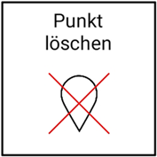
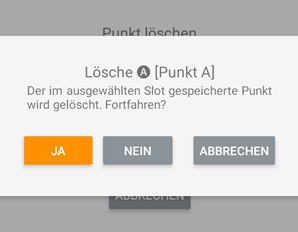

## Punkte löschen

Sollten Sie einen oder mehrere Ihrer bereits abgespeicherten Punkte für künftige Bauarbeiten nicht mehr benötigen, können Sie diese(n) wieder aus Ihrer Punkteliste löschen. Hierzu den zugehörigen Punkt-Slot auswählen und auf “Punkt löschen” klicken.