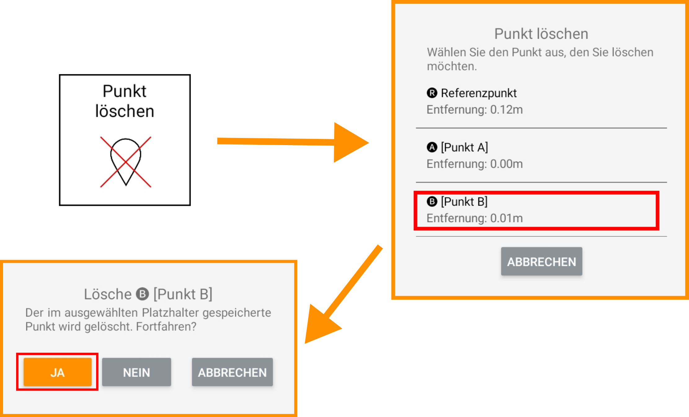

## Punkte löschen

<!-- 

   

 -->

<!-- 

 -->

Sollten Sie einen oder mehrere Ihrer bereits abgespeicherten Punkte für künftige Bauarbeiten nicht mehr benötigen, können Sie diese(n) wieder aus Ihrer Punkteliste löschen. Wählen Sie hierzu den zugehörigen Punkt-Slot aus und bestätigen Sie mit "Ja".