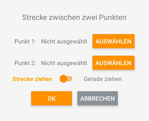

## Strecken und Geraden ziehen / löschen

<!--  -->

Sie können in der Kartenansicht der Arbeitsansicht auch Strecken bzw. Geraden abbilden. Erfassen Sie hierfür den Startpunkt und Endpunkt der Strecke als Punkte in der App ([Punkte erfassen](https://docs.excav.de/app/funktionen/punkte_und_flächen/punkte_erfassen/)). Wählen Sie die erfassten Punkte im Anschluss aus. Bestimmen Sie mithilfe des darunterliegenden Reglers, ob Sie die Punkte mit einer Strecke verbinden möchten oder eine durchgehende Gerade legen wollen und bestätigen Sie Ihre Auswahl mit “OK”. Die Strecke wird automatisch generiert und ist in der Arbeitsansicht einsehbar. 
Wird die erstellte Strecke bzw. Gerade für anschließende Bauarbeiten nicht mehr benötigt und die Bauplanübersicht dadurch behindert, können Sie diese mithilfe von “Strecke löschen” auch wieder entfernen. 