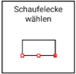
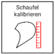

# Schaufeleinstellungen

## Schaufelecke wechseln

Diese Funktion bietet Ihnen die Möglichkeit, Ihre während der Kalibrierung festgelegte Schaufelecke (primär notwendig zum Antasten von Punkten) zu wechseln. Je weiter die Schaufelecke vom Sensor entfernt ist, desto größer wird der Höhenfehler. Wir empfehlen daher, im Normalfall die Mitte oder die rechte Schaufelecke (bei Montage des Sensors auf der rechten Seite) zu nutzen. Sollte der Sensor links montiert sein, empfehlen wir entsprechend die Mitte oder die linke Schaufelecke.

## Schaufelmaße abändern / neu bestimmen

Mit dieser Funktion können Sie die bereits während der Kalibrierung vorgenommene Abmessungen der Schaufel ändern (z.B. falls Sie sich vermessen haben oder die Schaufel gewechselt wurde, siehe [Schaufel vermessen](https://docs.excav.de/erste_schritte/einrichten/#schaufel-vermessen)). 
