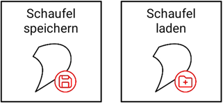

# Schaufeleinstellungen

## Schaufelecke wechseln

Diese Funktion bietet Ihnen die Möglichkeit, Ihre während der Kalibrierung festgelegte Schaufelecke (primär notwendig zum Antasten von Punkten) zu wechseln. Je weiter die Schaufelecke vom Sensor entfernt ist, desto größer wird der Höhenfehler. Wir empfehlen daher, im Normalfall die Mitte oder die rechte Schaufelecke (bei Montage des Sensors auf der rechten Seite) zu nutzen. Sollte der Sensor links montiert sein, empfehlen wir entsprechend die Mitte oder die linke Schaufelecke.

## Schaufelmaße abändern / neu bestimmen

Mit dieser Funktion können Sie die bereits während der Kalibrierung vorgenommene Abmessungen der Schaufel ändern (z.B. falls Sie sich vermessen haben oder die Schaufel gewechselt wurde, siehe [Schaufel vermessen](https://docs.excav.de/erste_schritte/einrichten/#schaufel-vermessen)). 

## Schaufelmaße abspeichern / laden

Sie können Ihre Schaufelmaße - falls bereits vermessen - auch abspeichern. Wir bieten Ihnen hierfür zwei Alternativen an:

* Sie können die Schaufelmaße auf dem Sensor speichern. In diesem Fall können Sie die Schaufelmaße über den Button "Schaufel laden" jederzeit vom Sensor laden
* Sie können die Schaufelmaße auf einem Schaufel-RFID-Tag speichern. Dieser kann zum Beispiel direkt an der Schaufel befestigt werden und der Sensor muss lediglich daraufgesetzt werden und erkennt die Schaufel automatisch. 

