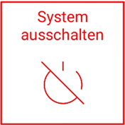

## Ausschalten und verstauen

Die Hardware kann über “Funktionen => System ausschalten” komplett abgeschaltet werden. Alternativ können durch die Betätigung der Drucktaster an Basisstation, Anzeige und Sensor diese abgeschaltet werden. 

Das Tablet kann über den Ein/Aus Taster in den Ruhemodus versetzt werden. Dies spart Akku und die Konfiguration des Sensors geht dabei nicht verloren. Es kann dann auch weiterhin mit der Anzeige gearbeitet werden.
