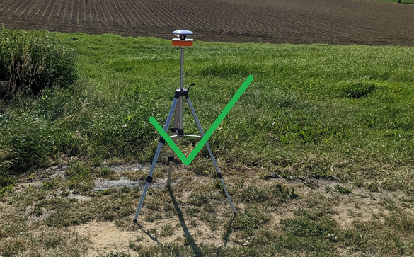
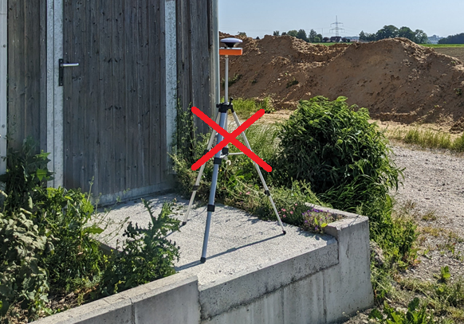
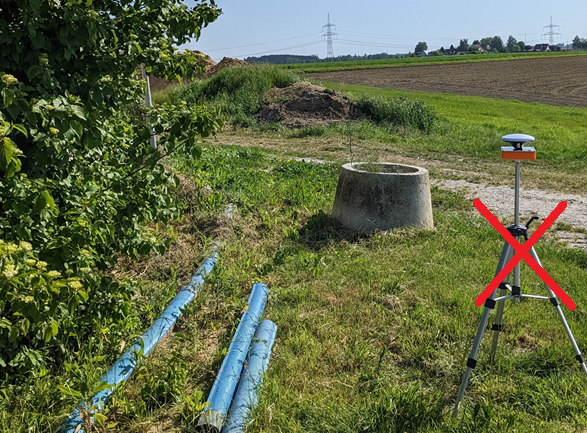
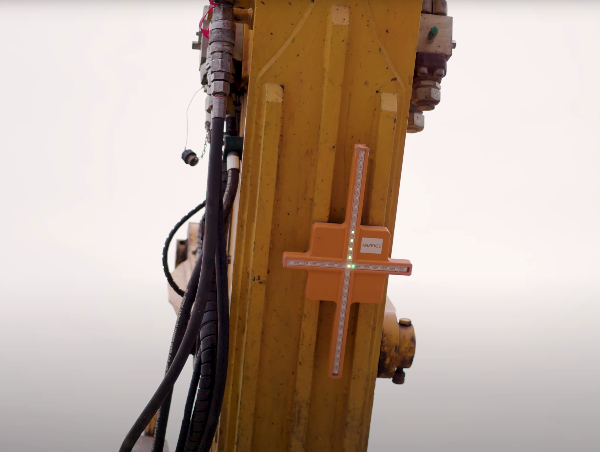
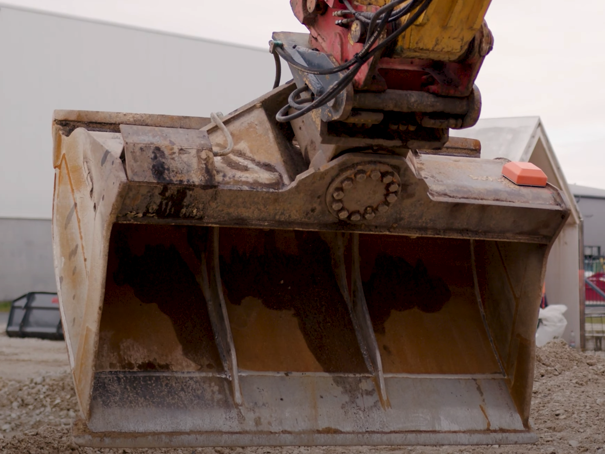
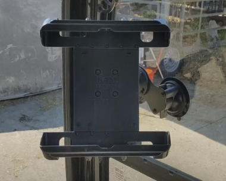
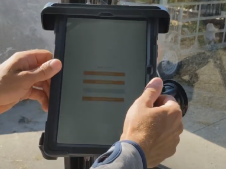

# Aufbauen und Anbringen

Ein Live-Beispiel zum Aufbauen und Einrichten des Systems finden Sie auch in unserer [Videoanleitung](https://www.youtube.com/watch?v=dZmhDPmHHl0){:target="_blank"} (auch in der App abspielbar).

## Basisstation aufstellen

Bitte beachten Sie beim Aufstellen der Basisstation folgende Richtlinien:

* Die Basisstation sollte erhöht auf einem Stativ positioniert werden, damit der Satellitenempfang nicht durch in der Nähe befindliche Objekte (Baum, Haus, Container, etc.) gestört wird. Die Höhe des nächstgelegenen Objektes sollte als Mindestmaß an Abstand eingehalten werden.
* Die Basisstation muss unter freiem Himmel aufgestellt werden, um einen idealen Satellitenempfang zu gewährleisten.
* Die Basisstation darf während der Arbeiten nicht bewegt werden.
* Die Basisstation muss auf festem Untergrund platziert werden.

!!! warning "Vorsicht bei Standortwahl"
    Gehen Sie bei der Wahl eines geeigneten Standorts besonders sorgsam vor und wählen Sie eine möglichst freie Position. Denn auch höhere Bäume oder Häuser im Radius von 15 Metern um die Basisstation können die Kommunikation beeinträchtigen. 

!!! danger "Kran auf der Baustelle"
    Besonders problematisch für die Qualität der Korrekturdaten ist ein größerer, aktiver Kran auf der Baustelle (d.h. er ändert seine Position regelmäßig). Unter Umständen kann in diesem Fall nicht mit dem System gearbeitet werden.

!!! danger "Vorsicht vor weichem Untergrund"
    Beim Platzieren der Basisstation auf weichem Untergrund kann es passieren, dass sich die Position der Basisstation während der Arbeiten durch Absinken des Stativs verändert. Dies hat zur Folge, dass sich alle erstellten Punkte/Ebenen um die selbe Abweichung verschieben. Folglich sind alle nachfolgenden Arbeiten fehlerhaft.

Schalten Sie die Basisstation erst nach erfolgter Standortwahl an, indem Sie den Knopf auf der Unterseite des Gehäuses drücken. Ein grün leuchtender Knopf bedeutet, dass die Basisstation eingeschaltet ist.

## Anzeigekreuz anbringen

Schalten Sie das Anzeigekreuz an, indem Sie den Knopf auf der Rückseite des Gehäuses drücken. Ein grün leuchtender Knopf bedeutet, dass die LED-Anzeige eingeschaltet ist.

Befestigen Sie das Anzeigekreuz anschließend mit den angebrachten Magneten auf mittlerer Höhe an der zur Fahrerkabine zeigenden Seite des Baggerarms. Achten Sie hierbei auf gute Sichtbarkeit aus der Fahrerkabine. 

!!! info "WLAN"
    Das Anzeigekreuz dient nicht nur der visuellen Unterstützung, sondern spannt auch das WLAN-Netz für das Tablet auf. Zusätzlich wird über das Anzeigekreuz ein zweiter Kommunikationskanal zwischen Sensor und Basisstation bereitgestellt, sollte die Verbindungsqualität durch z.B. Ausschachtungsarbeiten beeinträchtigt sein. Entsprechend kann es bei tieferen Arbeiten Abhilfe schaffen, das Anzeigekreuz weiter oben am Baggerstil zu montieren. 

## Sensor anbringen

Schalten Sie den Sensor ein, indem Sie den Knopf auf der Unterseite des Gehäuses drücken. Ein grün leuchtender Knopf bedeutet, dass der Sensor eingeschaltet ist.

Befestigen Sie den Sensor an der Baggerschaufel. Beachten Sie dabei bitte folgende Richtlinien:

* Der Sensor sollte möglichst weit außen auf der von der Fahrerkabine aus gesehen rechten oberen Seite der Schaufel befestigt werden.
* Der Sensor darf nicht über den Rand des Löffels hinausragen.
* Der Pfeil auf der Oberseite des Sensors muss zur Fahrerkabine zeigen.
* Die Hinterkante des Sensors muss parallel zur Schaufelschneide verlaufen.
* Der Sensor darf nicht durch Hydraulik oder überstehende Bleche verdeckt werden.
* Der Sensor sollte auf einem möglichst geschützten Bereich am Löffels befestigt werden.

!!! danger "Löffel bzw. Schaufel an der Anbringstelle ordentlich säubern"
    Der Löffel bzw. die Schaufel muss an der Anbringstelle des Sensors sauber sein, sodass die Magneten direkt das Metall berühren und keine Dreckschicht dazwischen liegt. Auch wenn diese nur aus etwas Sand besteht, kann dies die Magnetstärke signifikant beeinträchtigen. 

!!! danger "Sensor sorgfältig anbringen"
    Sowohl das Anbringen des Sensors als auch das im nächsten Kapitel beschriebene Einmessen des Löffels sind von äußerster Wichtigkeit. Ist die Einrichtung des Sensors fehlerhaft, so kann dies die Qualität der darauffolgenden Arbeiten nachhaltig beeinträchtigen.

Die richtige Anbringung des Sensors auf der Baggerschaufel ist entscheidend für gute Ergebnisse und lässt sich rein textbasiert nicht ganz trivial beschreiben. Wir empfehlen daher, dass Sie sich auch mithilfe der grafischen Anleitung in unserem [youtube Video](https://youtu.be/dZmhDPmHHl0?t=162){:target="_blank"} informieren (auch in der App abspielbar).

## Tablet und Halterung im Fahrerhaus anbringen

Der Tablet-Halter wird an einer Fensterscheibe auf der Innenseite der Fahrerkabine des Baggers befestigt. Achten Sie dabei bitte auf eine saubere Fensterscheibe. Drücken Sie die Halterung an gewünschter Stelle an die Fensterscheibe und drehen Sie diese an den beiden Saugnäpfen fest. Prüfen Sie anschließend durch leichtes Wackeln den sicheren Sitz der Saugnäpfe. Danach kann die Halterung in die gewünschte Position geschwenkt werden. Schrauben Sie hierzu das Bindeglied zwischen Saugnäpfen und Halterung leicht auf und ziehen Sie es nach Positionierung wieder fest. Das Tablet kann nachfolgend in die Halterung eingeschoben werden.

!!! info "Anfeuchten der Saugnäpfe"
    Sollte sich der Tablet-Halter wiederholt von der Scheibe lösen, so können Sie die Saugnäpfe etwas anfeuchten. Dies garantiert einen besseren Halt an der Scheibe. 

Mit den Knöpfen an der Seite des Tablets kann dieses ein- und ausgeschaltet werden.
Sofern der Bagger über einen Zigarettenanzünder oder einen 5V- bzw. 12V-Anschluss verfügt, können Sie das Tablet auch an den Strom anschließen.
Falls Sie mit einem Tablet den ganzen Tag auf Akku arbeiten möchten, empfehlen wir, dieses in den Pausen abzuschalten.

