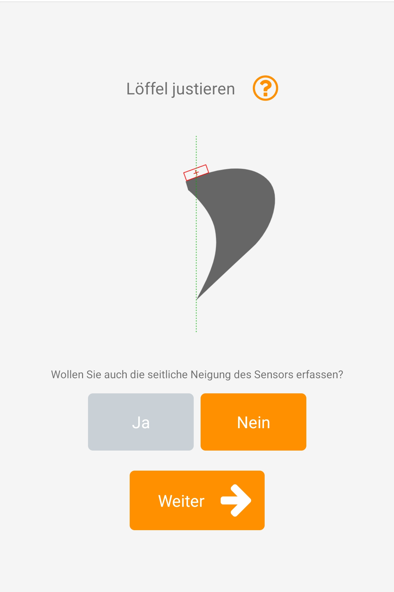

# System einrichten

Lesen Sie sich bitte die folgenden Unterpunkte sorgfältig durch und starten Sie anschließend die App (excav Pilot, excav Logo, grauer Hintergrund). Unter “Home => Einrichtungsassistent" finden Sie ein geführtes Menü zur Kalibrierung Ihres Systems. Vergewissern Sie sich bitte davor, dass die einzelnen Geräte gemäß des Abschnitts [Aufbauen und Anbringen](https://docs.excav.de/erste_schritte/aufbauen/) richtig aufgestellt bzw. an Baggerarm und Baggerschaufel befestigt wurden. 

Unter "Home => Videoanleitung" finden Sie eine ausführliche Videoanleitung, in der ein komplettes Setup durchgeführt und erklärt wird. Wir raten Erstnutzern dringend an, bei der Systemeinrichtung auf die Videoanleitung zurückzugreifen und den nachstehenden Leitfaden nur unterstützend zu verstehen. 

## Geräte verbinden

Bevor Sie mit der Konfiguration des Systems starten können, müssen Basisstation, Anzeige und der Sensor verbunden sein. Sollte die Verbindung eines oder mehrerer Geräte fehlschlagen, prüfen Sie bitte zuerst den Akkustand und ob die entsprechenden Geräte eingeschaltet sind. Versuchen Sie bei dennoch anhaltenden Verbindungsproblemen, die Geräte näher zusammenzubringen.

## Kalibriertool anbringen
Gehen Sie bei der Anbringen des Kalibriertools an der Schaufel wie folgt vor: 

* Positionieren Sie die Schaufel mit der Schneide auf einem ebenen und stabilen Untergrund, die Schneide darf nicht einsinken
* Neigen Sie die Schaufel so, dass der Sensor mit der Schneide ungefähr im Lot ist. Bringen Sie anschließend das Kalibriertool an der Schaufelseite an, sodass der blaue Punkt auf dem Sensor in der Mitte des kleinen Rohres erscheint 
* Befestigen Sie den Meterstab so in die Halterung am Ende des Kalibriertools, dass dieser am Ort der Schaufelschneide den Boden berührt. Der Meterstab kann durch leichtes Drücken in das Kalibriertool fixiert werden

## Schaufel vermessen

Die nachstehenden Schritte müssen sorgfältig ausgeführt werden, da ansonsten Messfehler entstehen, die sich in der späteren Arbeit fortsetzen.

Lesen Sie die Höhe (Distanz zwischen Kalibriertoolmarkierung und Schaufelspitze) vom Meterstab am Kalibriertool ab und tragen Sie diese in der App ein.
Bestimmen Sie anschließend den seitlichen Versatz (Einrückung) vom Sensor. Dies ist die Distanz von der Sensormitte bis zur von der Fahrerkabine gesehen rechten Außenseite der Schaufel. Bei manchen Schaufeln sind die Seitenwände leicht angeschrägt oder die Schneide steht etwas über. Messen Sie in diesem Fall die geschätzte Distanz bis zum äußersten Punkt der Schaufel(schneide). Tragen Sie den ermittelten Wert in die App ein.
Zuletzt muss noch die Breite der Schneide gemessen und in die App eingetragen werden. Diese entspricht dem Abstand von linker und rechter Schaufelecke. 

Lassen Sie das Kalibriertool für den nachfolgenden Schritt an der Schaufel befestigt.  

Sollten Sie die Schaufel bereits in der Vergangenheit vermessen haben und diese Maße auf dem Sensor gespeichert haben, können Sie diese abrufen, indem Sie auf “Schaufel laden” klicken. Nach erfolgreichem Laden der Schaufelmaßen können Sie obigen Schritt überspringen. Ausführlichere Informationen zum Speichern von Schaufelmaßen auf dem Sensor finden Sie unter "Schaufelmaße abspeichern”.

## Schaufel justieren

Heben Sie die Schaufel als nächstes leicht an und neigen Sie diese, bis die Spitze des Meterstabs exakt mit der Schneide übereinstimmt (das Kalibriertool mit fixiertem Meterstab dient Ihnen als Hilfe, das Lot zu finden). Holen Sie sich hierzu ggf. eine zweite Person zu Hilfe, die die Position von der Seite überprüft. Bestätigen Sie diese in der App mit “Weiter”. 

## Schaufelecke wählen

Als nächstes können Sie die gewünschte Schaufelecke auswählen. Von dieser wird die Höhendifferenz zur Planierfläche berechnet. Des Weiteren wird sie zur Erfassung von Punkten auf der Baustelle herangezogen. 
Den genauesten Messwert erhalten Sie an der am nächsten zum Sensor befindlichen Ecke. Bei stark abgenutzten Ecken der Schneide empfiehlt sich die mittlere Position zum Antasten von Punkten, bei denen primär die Höhe relevant ist.

## Referenzpunkt setzen

Der Referenzpunkt dient als Nullpunkt, von dem aus alle weiteren Maße errechnet werden. Hierfür bietet sich eine Stelle auf der Baustelle an, die über den gesamten Bauverlauf verfügbar bleibt, jederzeit gut zu erreichen ist und freie Sicht auf den Himmel bietet.
Zur Erfassung des Referenzpunkts die ausgewählte Schaufelecke an die entsprechende Stelle bewegen, auf “Referenzpunkt setzen” klicken und dann 3 Sekunden warten, bis der Referenzpunkt vermessen ist.

