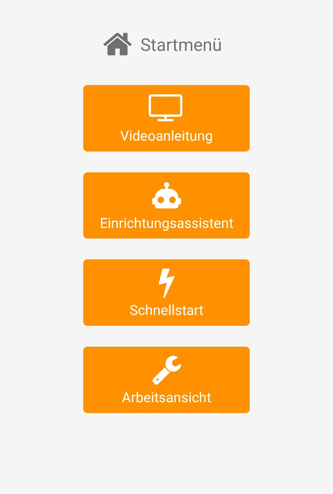
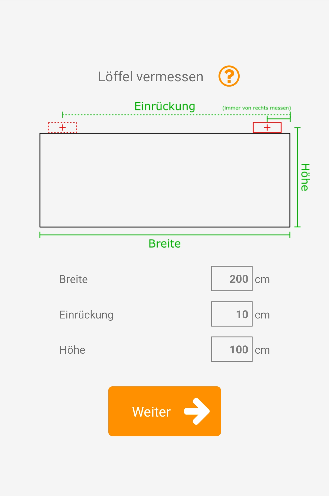
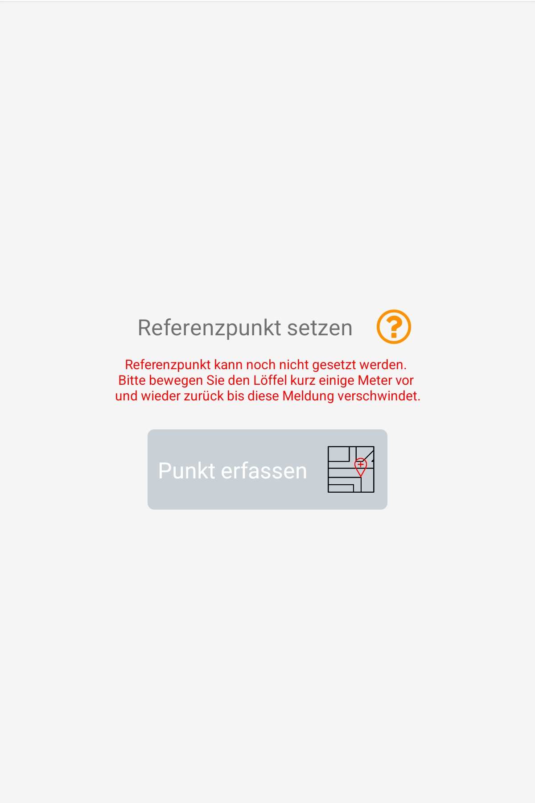

# System einrichten
<!--  -->

  

Lesen Sie sich bitte die folgenden Unterpunkte sorgfältig durch und starten Sie anschließend die excav PILOT App. Dort finden Sie unter “Startmenü => Einrichtungsassistent" ein geführtes Menü zur Kalibrierung Ihres Systems. Vergewissern Sie sich bitte davor, dass die einzelnen Geräte gemäß des vorherigen Abschnitts [Aufbauen und Anbringen](https://docs.excav.de/erste_schritte/aufbauen_und_anbringen/) richtig aufgestellt bzw. an Baggerarm und Löffel befestigt wurden. 

Es gibt eine ausführliche [Videoanleitung](https://www.youtube.com/watch?v=dZmhDPmHHl0){:target="_blank"} auf youtube (auch in der App abspielbar), in der ein komplettes Setup durchgeführt und erklärt wird. Wir raten Erstnutzern dringend, bei der Systemeinrichtung auf die Videoanleitung zurückzugreifen und den nachstehenden Leitfaden nur unterstützend zu verstehen.

## Geräte verbinden
<!--  -->

  

Bevor Sie mit der Konfiguration des Systems starten können, müssen Basisstation, Anzeige und der Sensor verbunden sein. Sollte die Verbindung eines oder mehrerer Geräte fehlschlagen, prüfen Sie bitte zuerst den Akkustand und ob die entsprechenden Geräte eingeschaltet sind. Versuchen Sie bei dennoch anhaltenden Verbindungsproblemen die Geräte näher zusammenzubringen.

## Arbeitsplatz anlegen/laden

  

Um einen neuen Arbeitsplatz anzulegen, wählen Sie "Neuer Arbeitsplatz". Sie können hier auch einen bereits angelegten Arbeitsplatz laden. Das Laden eines Arbeitsplatzes wird [hier](https://docs.excav.de/app/funktionen/arbeitseinstellungen/arbeitsplatz_laden/) beschrieben.

## Baumaschine wählen

  

Wählen Sie hier die Baumaschine aus, an der Sie den PILOT anbringen wollen. Der Einrichtungsprozess läuft für jede Maschine gleich ab. Einzig der Messstab wird direkt geladen und bedarf keiner weiteren Kalibrierung. 

## Löffel vermessen
<!--  -->

  

Die nachstehenden Schritte müssen sorgfältig ausgeführt werden, da ansonsten Messfehler entstehen, die sich in der späteren Arbeit fortsetzen. Bitte messen Sie bis auf eine Nachkommastelle genau.

Bestimmen Sie zuerst die Breite der Löffelschneide und tragen Sie den Wert in der App ein.

Danach bestimmen Sie den seitlichen Versatz (Einrückung) des Sensors. Dies ist die Distanz von der Sensormitte bis zur von der Fahrerkabine gesehen rechten Außenseite des Löffels. Tragen Sie den ermittelten Wert in die App ein.
!!! info "Abgenutzte Löffelschneide" 
    Bei manchen Löffeln sind die Seitenwände leicht angeschrägt oder die Schneide steht etwas über. Messen Sie in diesem Fall die geschätzte Distanz bis zum äußersten Punkt der Löffelschneide.   

Wie Sie die Höhe des Löffels mithilfe des Kalibriertools ablesen wird Ihnen im nächsten Kapitel erklärt.

## Kalibriertool anbringen

  
  

Gehen Sie bei der Anbringen des Kalibriertools am Löffel wie folgt vor: 

* Positionieren Sie den Löffel mit der Schneide auf einem ebenen und stabilen Untergrund. Die Schneide darf nicht einsinken.
* Bringen Sie anschließend das Kalibriertool an der Löffelseite an, sodass der blaue Punkt auf dem Sensor in der Mitte des kleinen Rohres erscheint.
* Befestigen Sie den Meterstab so in der Halterung am Ende des Kalibriertools, dass dieser am Ort der Löffelschneide den Boden berührt. Der Meterstab kann durch leichtes Drücken in das Kalibriertool fixiert werden.
* Lesen Sie anschließend die Höhe ab. Sie ist der Abstand zwischen Löffelschneide und Markierung (Kerbe) am Kalibriertool.

Lassen Sie das Kalibriertool mit Meterstab für den nachfolgenden Schritt am Löffel befestigt.

## Löffel justieren

  
  

Heben Sie den Löffel als nächstes leicht an und neigen Sie diese, bis die Spitze des Meterstabs exakt mit der Schneide übereinstimmt. Das Kalibriertool mit fixiertem Meterstab dient Ihnen dabei als Hilfe, das Lot zu finden. Holen Sie sich hierzu ggf. eine zweite Person zu Hilfe, die die Position von der Seite überprüft. Ist die angegebene Position eingenommen, dann bestätigen Sie dies in der App mit “Weiter”. 

## Löffelecke wählen
<!--  -->

  

Als nächstes können Sie die gewünschte Löffelecke auswählen. Von dieser wird die Höhendifferenz zur Planierfläche berechnet. Des Weiteren wird sie zur Erfassung von Punkten auf der Baustelle herangezogen. 
Den genauesten Messwert erhalten Sie an der am nächsten zum Sensor befindlichen Ecke. Bei stark abgenutzten Ecken der Schneide empfiehlt sich die mittlere Position zum Antasten von Punkten, bei denen primär die Höhe relevant ist.

## Referenzpunkt setzen
<!--  -->

  
  

Der Referenzpunkt dient als Nullpunkt, von dem aus alle weiteren Maße errechnet werden. Hierfür bietet sich eine Stelle auf der Baustelle an, die über den gesamten Bauverlauf verfügbar bleibt, jederzeit gut zu erreichen ist und freie Sicht auf den Himmel bietet.
Zur Erfassung des Referenzpunkts müssen Sie die ausgewählte Löffelecke an die entsprechende Stelle bewegen, auf “Referenzpunkt setzen” klicken und dann 3 Sekunden warten, bis der Referenzpunkt vermessen ist.

