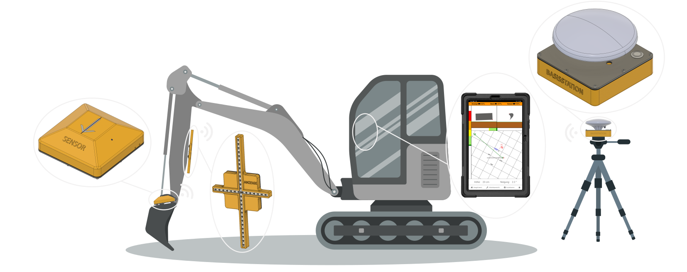
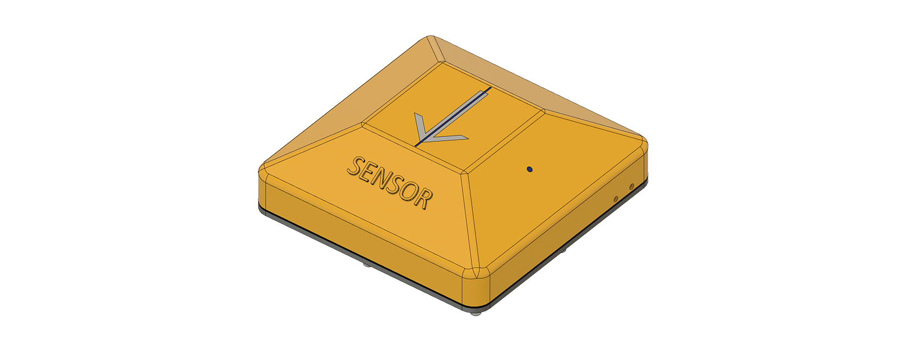
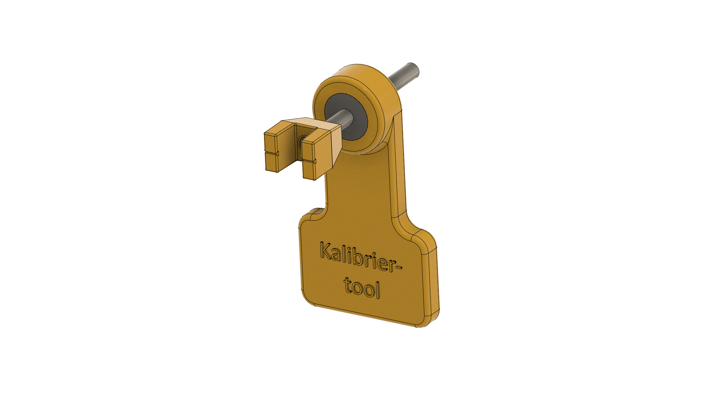

# Geräteübersicht
Eine schnelle Übersicht der im Koffer befindlichen Systemteile und deren Anbringungsorte sowie deren technischen Daten.

## Basisstation
Die Basisstation dient zur Ermittlung der GNSS-Korrekturdaten (Globales Navigationssatellitensystem). 

## Anzeigekreuz

Das Anzeigekreuz bietet visuelle Unterstützung bei der Erfassung der Löffelposition in Relation zur Planierfläche. 

Der vertikale LED-Strang informiert über die Höhendifferenz von Löffelschneide und eingegebener Soll-Höhe.

* Ein LED-Ausschlag nach oben bedeutet, dass sich der Löffel noch über der eingegebenen Soll-Höhe befindet 
* Ein LED-Ausschlag nach unten bedeutet, dass sich der Löffel bereits unter der eingegebenen Soll-Höhe befindet 

Der horizontale LED-Strang informiert über die Abweichung der frontalen Löffelneigung zur Flächen-Soll-Neigung. 

* Ein LED-Ausschlag nach rechts bedeutet, dass der Löffel zu weit nach rechts (im Uhrzeigersinn) geneigt ist
* Ein LED-Ausschlag nach links bedeutet, dass der Löffel zu weit nach links (gegen den Uhrzeigersinn) geneigt ist 

## Sensor

Der Sensor erfasst über GNSS und weitere Sensoren die Position, Lage und Ausrichtung des Löffels und errechnet daraus die resultierenden Steuerempfehlungen für den Baggerfahrer. Entsprechend ist eine präzise Anbringung und Vermessung essentiell für die Qualität der Ergebnisse.

## Tablet 
Das Tablet visualisiert die vom Sensor ermittelten Raumdaten von Löffel und Planierfläche. Zudem können Sensor und Anzeige über das Tablet nach Bedarf konfiguriert werden. Weitere Informationen und Beschreibungen zur Benutzeroberfläche und den Funktionen finden sich unter "App".

## Kalibriertool

Das Kalibriertool dient als Hilfe bei der Vermessung und Justierung des Löffels.

## Aufladen
Der Sensor, die Anzeige und die Basis verfügen über einen magnetischen Ladestecker auf der Unterseite. Das Tablet hat einen regulären USB-C Anschluss. Mit dem mitgelieferten Ladekabeln und Steckdosennetzteil kann das komplette System über Nacht aufgeladen werden.